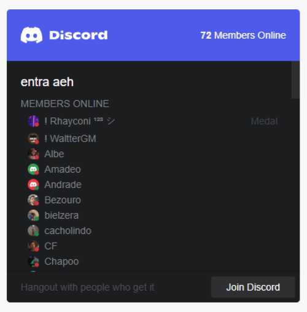

# React Discord Widget

[](https://github.com/SnowRunescape/react-discord-widget/releases)
[](https://github.com/SnowRunescape/react-discord-widget/blob/main/LICENSE)

## Demo

**[Storybook / Live Demo](https://snowrunescape.github.io/react-discord-widget/)**

## Overview

`react-discord-widget` is a React component library designed to seamlessly integrate <a href="https://discord.com" target="_blank">Discord</a> server information into your web application. Display the online member count, server channels, and a quick join button with ease, while also offering a customizable interface for a more personal touch.

## Features

- Display real-time server data: online members, channels, etc.
- Customizable styles to match your app's theme
- Light and Dark theme support
- Configurable via simple props
- TypeScript support for strong typing

## Example of usage
 <!-- Adjust the width and height as needed -->

## Quick Links

- [Installation](#installation)
- [Usage](#usage)
- [Generate Your Own Style](#generate-your-own-style)
- [License](#license)
- [Contributing](#contributing)

## Installation

```bash
npm install react-discord-widget
```
```bash
yarn add react-discord-widget
```

## Usage
### Basic Example
```typescript
import React from 'react';
import { Discord } from 'react-discord-widget';

function App() {
  return (
    <div>
      <h1>My Awesome Discord Server</h1>
      <Discord serverId="YOUR_SERVER_ID" />
    </div>
  );
}

export default App;
```

### Advanced Configuration
```typescript
<Discord
  serverId="YOUR_SERVER_ID"
  width={300}
  height={400}
  theme="dark"
  showMembers={true}
  showOnline={true}
  showJoinButton={true}
/>
```
## Generate your own style

The `useDiscord` hook provides an easy way to integrate Discord server information into your React application. It automatically fetches data from your Discord server and provides it, along with several utility states and functions, to your component.

### Parameters

- `id`: The Discord server ID for which you want to fetch information.
- `delay`: Optional. The number of seconds to wait before re-fetching the data. Defaults to 120 seconds if not specified.

### Return Values

The hook returns an object containing:

- `isLoading`: A boolean that indicates if the data is currently being loaded.
- `error`: An error object if the request failed, or `null` if there's no error.
- `data`: The server data retrieved from Discord's API, or `null` if the data is not available yet.
- `refetch`: A function to manually re-fetch the data from the server.
- `remove`: A function that resets the data and error states and sets `isLoading` to `true`.
- `delay`: The actual delay that is used for the automatic refetch, in seconds.

### Usage Example

```jsx
const discordInfo = useDiscord({
  id: 'YOUR_SERVER_ID',
  delay: 120
});
```

Here's how you would typically use useDiscord within a functional component:
```typescript
import React from 'react';
import { useDiscord } from 'react-discord-widget';

function DiscordComponent() {
  const { isLoading, data, error, refetch } = useDiscord({
    id: 'YOUR_SERVER_ID'
  });

  if (isLoading) {
    return <div>Loading...</div>;
  }

  if (error) {
    return <div>Error: {error.toString()}</div>;
  }

  return (
    <div>
      <h1>Discord Server Info</h1>
      {data && (
        <div>
          <p>Server Name: {data.name}</p>
          <button onClick={refetch}>Refresh</button>
        </div>
      )}
    </div>
  );
}
```

## License
This project is licensed under the [MIT License](https://github.com/SnowRunescape/react-discord-widget/blob/master/LICENSE). Feel free to use and modify it as you see fit.

## Contributing
Please report any issues or suggestions on the repository's issue tracker.

Feel free to use and enjoy the `react-discord-widget` component in your web applications! If you have any questions or need assistance, don't hesitate to reach out or open an issue on the GitHub repository.
